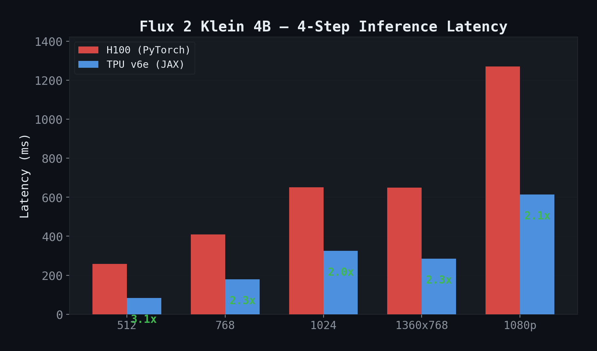
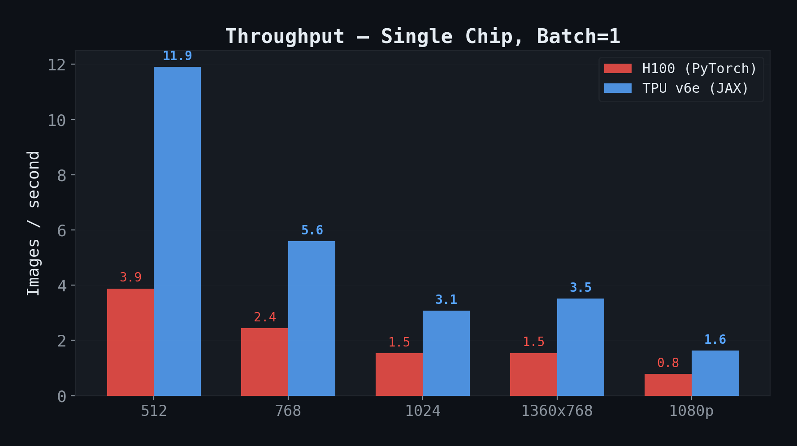
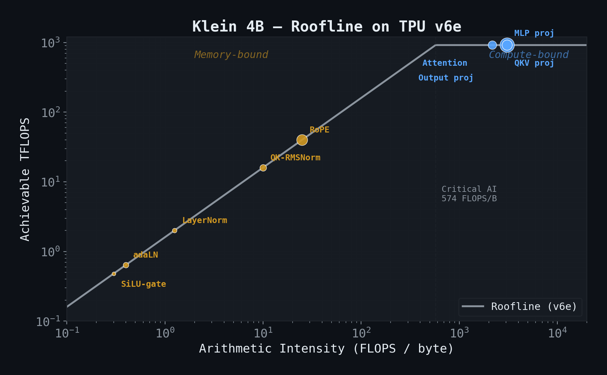
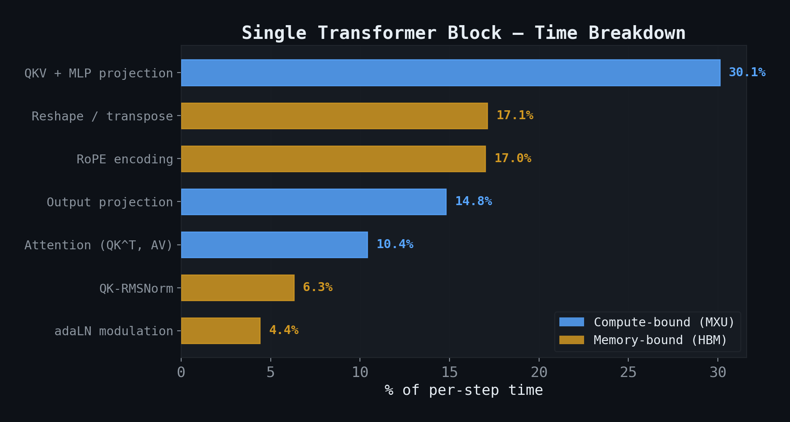
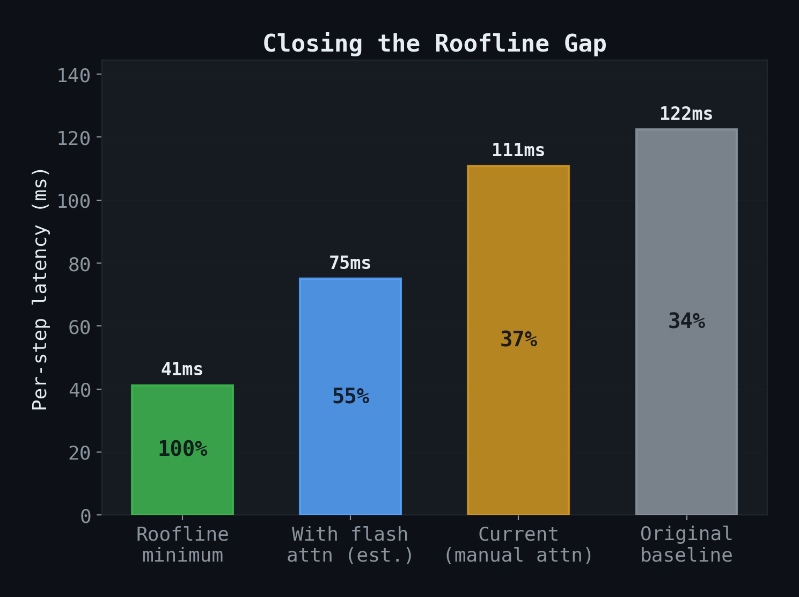

# nanoflux2-jax

A from-scratch JAX port of [Black Forest Labs' Flux 2 Klein 4B](https://huggingface.co/black-forest-labs/FLUX.2-klein-4B) that runs **2-3x faster than H100** on a single TPU v6e chip.

~500 lines of model code. ~120 lines of sampling. Download the weights from HuggingFace. That's it.

<p align="center">
  
  
</p>
<p align="center">
  
  
</p>
<p align="center">
  <sub>All images generated on TPU v6e in under 300ms. Pixel-identical to PyTorch reference (cos_sim > 0.999).</sub>
</p>

---

## Performance

| Resolution | H100 (PyTorch) | TPU v6e (JAX) | Speedup |
|:-----------|:--------------:|:-------------:|:-------:|
| 512x512    | 258ms          | **84ms**      | **3.1x** |
| 768x768    | 409ms          | **179ms**     | **2.3x** |
| 1024x1024  | 651ms          | **325ms**     | **2.0x** |
| 1360x768   | 649ms          | **285ms**     | **2.3x** |
| 1920x1080  | 1,271ms        | **614ms**     | **2.1x** |

<sub>4-step distilled denoise, bf16, batch=1. H100 baseline uses official BFL PyTorch code.</sub>

<p align="center">
  
</p>

That's **11.9 images/second** at 512x512 on a single TPU v6e chip.

<p align="center">
  
</p>

## Why TPU?

Klein 4B is a flow-matching diffusion transformer (MMDiT). ~75% of its compute is large matrix multiplications -- QKV projections, MLP layers, attention -- exactly what the TPU's 256x256 systolic array was designed for.

The key number is the **critical arithmetic intensity**: the ratio of peak compute to memory bandwidth.

```
TPU v6e: 918 TFLOPS / 1.6 TB/s = 574 FLOPS/byte
H100:    989 TFLOPS / 3.35 TB/s = 295 FLOPS/byte
```

Klein's dominant operations have arithmetic intensities around 3,000 -- deeply compute-bound on both machines. But XLA sees the entire computation graph at compile time and automatically fuses the memory-bound glue operations (norms, reshapes, activations) between the matmuls.

<p align="center">
  
</p>

<p align="center">
  
</p>

## Architecture

The port is pure functional JAX. No Flax, no nn.Module, no framework overhead.

```
src/flux2_jax/
  model.py           # ~484 lines — full Klein 4B architecture
  sampling.py         # ~122 lines — flow-matching denoise loop
  convert_weights.py  # ~149 lines — PyTorch checkpoint → JAX pytree
```

Key design decisions:

- **Pure functions**: `forward(params, x) -> y`. Parameters live in a pytree.
- **`jax.lax.scan`** over the 20 identical single-stream blocks -- compilation is O(1) regardless of depth. JIT takes ~5 seconds.
- **Full-loop JIT**: the entire 4-step denoise is traced at once. This is **4.3x faster** than step-by-step JIT because XLA optimizes buffer reuse across steps.
- **Bit-exact to PyTorch**: cosine similarity > 0.999 against the reference implementation.

## Quickstart

```bash
# Install
pip install jax[tpu] -f https://storage.googleapis.com/jax-releases/libtpu_releases.html
pip install safetensors transformers

# Download weights from HuggingFace
# https://huggingface.co/black-forest-labs/FLUX.2-klein-4B

# Generate
python -c "
from flux2_jax.model import build_model
from flux2_jax.sampling import sample
from flux2_jax.convert_weights import load_weights

params = load_weights('path/to/klein-4b')
img = sample(params, prompt='a watercolor painting of a Japanese garden in autumn')
"
```

## Samples

All generated on TPU v6e, 4-step denoise, bf16:

<p align="center">
  
  
</p>
<p align="center">
  
  
</p>

## Roofline Analysis

The theoretical minimum per step (1024x1024) is 41ms. We achieve 81ms -- about 51% of roofline peak. The gap comes from data movement between matmuls (reshapes, norms, RoPE) which are memory-bound.

With a working flash attention kernel (currently broken on v6e -- [see below](#known-issues)), we'd expect ~75ms per step, or 55% of roofline.

<p align="center">
  
</p>

## Known Issues

**JAX attention kernel bug on TPU v6e**: `jax.nn.dot_product_attention` produces silently incorrect results on TPU v6e (cosine similarity ~0.02 vs correct answer). All three TPU attention APIs are affected. The port uses manual einsum attention as a workaround, which is correct but doesn't benefit from flash attention's memory savings. Bug report filed with the JAX team.

## Acknowledgments

Huge shoutout to [Black Forest Labs](https://bfl.ai) for building Klein. The architecture is beautifully clean -- the same design clarity that makes it fast on CUDA made it trivially portable to XLA. The model weights are available under Apache 2.0 on [HuggingFace](https://huggingface.co/black-forest-labs/FLUX.2-klein-4B).

## Citation

```bib
@misc{nanoflux2-jax,
    title={nanoflux2-jax: Flux 2 Klein 4B on TPU v6e},
    year={2026},
    howpublished={\url{https://github.com/YOUR_USERNAME/nanoflux2-jax}},
}

@misc{flux-2-2025,
    author={Black Forest Labs},
    title={{FLUX.2: Frontier Visual Intelligence}},
    year={2025},
    howpublished={\url{https://bfl.ai/blog/flux-2}},
}
```

## License

The JAX port code is MIT licensed. Model weights are subject to [Black Forest Labs' licensing](https://huggingface.co/black-forest-labs/FLUX.2-klein-4B) (Apache 2.0 for Klein 4B).
